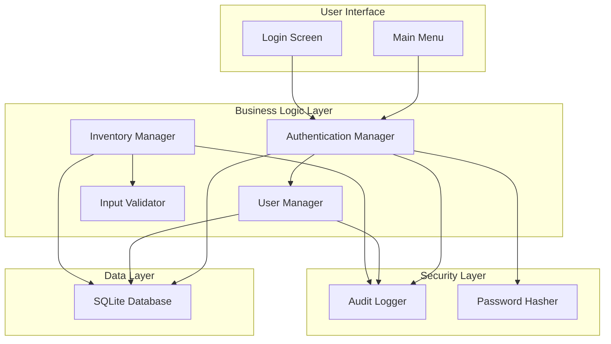
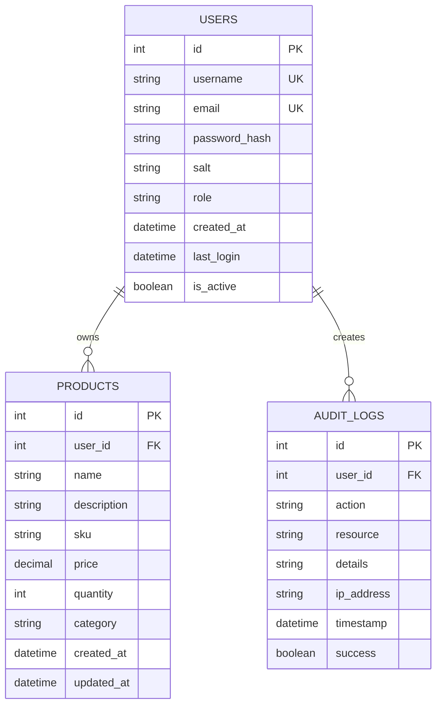
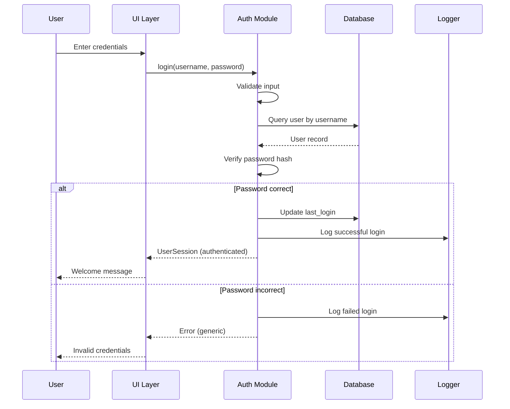
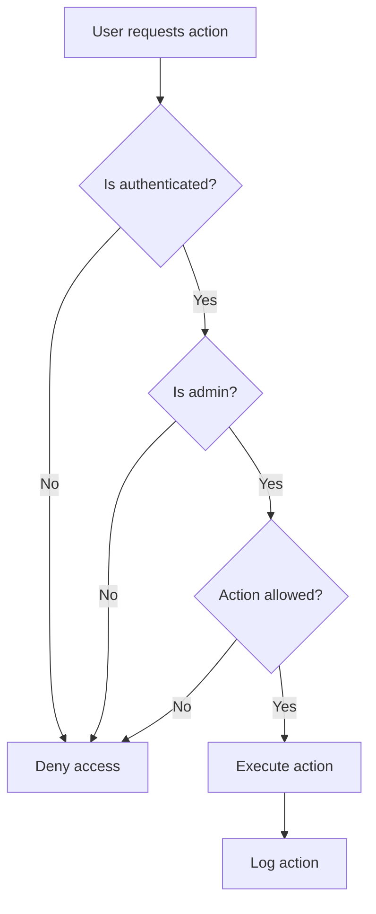

# Cnturion Inventory Manager - Complete Development Plan

## Project Overview

**Application:** Inventory Manager for Micro Businesses
**Language:** C
**Database:** SQLite
**Developers:** Nico and Ximena
**Course:** DevSecOps

This document provides a comprehensive guide to building a secure inventory management application in C with SQLite, following DevSecOps best practices.

---

## Table of Contents

1. [Security Requirements Summary](#security-requirements-summary)
2. [Project Architecture](#project-architecture)
3. [Database Design](#database-design)
4. [File Structure](#file-structure)
5. [Implementation Steps](#implementation-steps)
6. [Security Best Practices](#security-best-practices)
7. [Learning Guide](#learning-guide)

---

## 1. Security Requirements Summary

Based on the Tareas.pdf requirements, our application must implement:

### 1.1 Data Classification
- **Personal Data:** Usernames, emails
- **Sensitive Data:** Passwords (hashed), inventory data

### 1.2 CIA Triad Considerations
- **Confidentiality:** Only authorized users can access data
- **Integrity:** Data cannot be altered without authorization
- **Availability:** System remains operational and accessible

### 1.3 Security Controls to Implement

| Control | Description | Implementation |
|---------|-------------|----------------|
| Authentication | Verify user identity | Username + password with bcrypt hashing |
| Authorization | Control access by role | Admin (full access) vs Regular User (inventory only) |
| Input Validation | Validate all user inputs | Type checking, length limits, format validation |
| SQL Injection Protection | Prevent SQL injection | Parameterized queries with prepared statements |
| Password Security | Secure password storage | bcrypt with salt |
| Logging & Auditing | Track security events | Log login attempts, data changes, errors |
| Error Handling | Secure error messages | Generic messages to users, detailed logs internally |
| Configuration Security | Protect secrets | Environment variables, separate config file |

---

## 2. Project Architecture

### 2.1 System Architecture Diagram



### 2.2 Layer Responsibilities

| Layer | Responsibility | Files |
|-------|---------------|-------|
| **Presentation** | User interface, menu navigation | `main.c`, `ui.c`, `ui.h` |
| **Business Logic** | Core application logic, rules | `auth.c`, `inventory.c`, `users.c` |
| **Data Access** | Database operations | `database.c`, `database.h` |
| **Security** | Authentication, authorization, logging | `security.c`, `security.h`, `logger.c`, `logger.h` |
| **Utilities** | Helper functions, validation | `utils.c`, `utils.h`, `validator.c`, `validator.h` |

---

## 3. Database Design

### 3.1 Schema Overview



### 3.2 Table Definitions

#### Table: `users`
Stores user authentication and authorization information.

| Column | Type | Constraints | Description |
|--------|------|-------------|-------------|
| `id` | INTEGER | PRIMARY KEY, AUTOINCREMENT | Unique user identifier |
| `username` | TEXT | UNIQUE, NOT NULL | User's login name |
| `email` | TEXT | UNIQUE, NOT NULL | User's email address |
| `password_hash` | TEXT | NOT NULL | bcrypt hashed password |
| `salt` | TEXT | NOT NULL | Salt for password hashing |
| `role` | TEXT | NOT NULL, CHECK(role IN ('admin', 'user')) | User role |
| `created_at` | TEXT | NOT NULL | Account creation timestamp |
| `last_login` | TEXT | NULL | Last successful login timestamp |
| `is_active` | INTEGER | DEFAULT 1 | Account status (1=active, 0=inactive) |

**Security Notes:**
- Passwords are NEVER stored in plain text
- bcrypt automatically handles salt internally
- Role-based access control (RBAC) enforced at application level

#### Table: `products`
Stores inventory items owned by users.

| Column | Type | Constraints | Description |
|--------|------|-------------|-------------|
| `id` | INTEGER | PRIMARY KEY, AUTOINCREMENT | Unique product identifier |
| `user_id` | INTEGER | FOREIGN KEY → users(id), NOT NULL | Owner of the product |
| `name` | TEXT | NOT NULL | Product name |
| `description` | TEXT | NULL | Product description |
| `sku` | TEXT | UNIQUE, NOT NULL | Stock Keeping Unit (unique code) |
| `price` | REAL | NOT NULL, CHECK(price >= 0) | Product price |
| `quantity` | INTEGER | NOT NULL, CHECK(quantity >= 0) | Available quantity |
| `category` | TEXT | NULL | Product category |
| `created_at` | TEXT | NOT NULL | Creation timestamp |
| `updated_at` | TEXT | NOT NULL | Last update timestamp |

**Security Notes:**
- Row-level security: users can only access their own products
- Foreign key ensures referential integrity
- CHECK constraints prevent invalid data

#### Table: `audit_logs`
Stores security-relevant events for auditing.

| Column | Type | Constraints | Description |
|--------|------|-------------|-------------|
| `id` | INTEGER | PRIMARY KEY, AUTOINCREMENT | Unique log entry identifier |
| `user_id` | INTEGER | FOREIGN KEY → users(id), NULL | User who performed action |
| `action` | TEXT | NOT NULL | Action performed (LOGIN, CREATE, UPDATE, DELETE) |
| `resource` | TEXT | NOT NULL | Resource affected (user, product, etc.) |
| `details` | TEXT | NULL | Additional details about the action |
| `ip_address` | TEXT | NULL | IP address of the request |
| `timestamp` | TEXT | NOT NULL | When the action occurred |
| `success` | INTEGER | NOT NULL | Whether action succeeded (1=yes, 0=no) |

**Security Notes:**
- Immutable audit trail (no UPDATE/DELETE on this table)
- Used for forensic analysis and compliance
- Helps detect suspicious activity patterns

### 3.3 SQL Initialization Script

```sql
-- Enable foreign key constraints
PRAGMA foreign_keys = ON;

-- Create users table
CREATE TABLE IF NOT EXISTS users (
    id INTEGER PRIMARY KEY AUTOINCREMENT,
    username TEXT UNIQUE NOT NULL,
    email TEXT UNIQUE NOT NULL,
    password_hash TEXT NOT NULL,
    salt TEXT NOT NULL,
    role TEXT NOT NULL CHECK(role IN ('admin', 'user')),
    created_at TEXT NOT NULL,
    last_login TEXT,
    is_active INTEGER DEFAULT 1
);

-- Create products table
CREATE TABLE IF NOT EXISTS products (
    id INTEGER PRIMARY KEY AUTOINCREMENT,
    user_id INTEGER NOT NULL,
    name TEXT NOT NULL,
    description TEXT,
    sku TEXT UNIQUE NOT NULL,
    price REAL NOT NULL CHECK(price >= 0),
    quantity INTEGER NOT NULL CHECK(quantity >= 0),
    category TEXT,
    created_at TEXT NOT NULL,
    updated_at TEXT NOT NULL,
    FOREIGN KEY (user_id) REFERENCES users(id) ON DELETE CASCADE
);

-- Create audit_logs table
CREATE TABLE IF NOT EXISTS audit_logs (
    id INTEGER PRIMARY KEY AUTOINCREMENT,
    user_id INTEGER,
    action TEXT NOT NULL,
    resource TEXT NOT NULL,
    details TEXT,
    ip_address TEXT,
    timestamp TEXT NOT NULL,
    success INTEGER NOT NULL,
    FOREIGN KEY (user_id) REFERENCES users(id) ON DELETE SET NULL
);

-- Create indexes for performance
CREATE INDEX IF NOT EXISTS idx_products_user_id ON products(user_id);
CREATE INDEX IF NOT EXISTS idx_audit_logs_user_id ON audit_logs(user_id);
CREATE INDEX IF NOT EXISTS idx_audit_logs_timestamp ON audit_logs(timestamp);
```

---

## 4. File Structure

```
Cnturion/
├── src/                    # Source code
│   ├── main.c             # Application entry point
│   ├── ui.c               # User interface functions
│   ├── ui.h               # UI header
│   ├── auth.c             # Authentication logic
│   ├── auth.h             # Authentication header
│   ├── inventory.c        # Inventory management
│   ├── inventory.h        # Inventory header
│   ├── users.c            # User management (admin only)
│   ├── users.h            # User management header
│   ├── database.c         # Database operations
│   ├── database.h         # Database header
│   ├── security.c         # Security functions (hashing, etc.)
│   ├── security.h         # Security header
│   ├── validator.c        # Input validation
│   ├── validator.h        # Validation header
│   ├── logger.c           # Audit logging
│   ├── logger.h           # Logging header
│   └── utils.c            # Utility functions
│       └── utils.h        # Utils header
├── include/               # External library headers
│   └── sqlite3.h          # SQLite header
├── lib/                   # Compiled libraries
│   └── libsqlite3.so      # SQLite library
├── data/                  # Runtime data
│   └── inventory.db       # SQLite database file
├── logs/                  # Application logs
│   └── app.log           # Main log file
├── tests/                 # Unit tests
│   ├── test_auth.c
│   ├── test_validator.c
│   └── test_database.c
├── docs/                  # Documentation
│   └── SECURITY.md        # Security documentation
├── config/                # Configuration files
│   └── config.env         # Environment variables (not in git)
├── Makefile              # Build configuration
├── README.md             # Project documentation
└── .gitignore            # Git ignore rules
```

---

## 5. Implementation Steps

### Step 1: Project Setup

**What you'll learn:**
- C project structure
- Makefile basics
- Library linking

**Tasks:**
1. Create directory structure
2. Download SQLite library
3. Create Makefile for compilation
4. Set up .gitignore

**Key Concepts:**
- Header files (.h) declare functions
- Source files (.c) implement functions
- Makefile automates compilation
- Libraries are linked with `-l` flag

### Step 2: Database Module

**What you'll learn:**
- SQLite C API
- Database connections
- Prepared statements (SQL injection protection)

**Key Functions:**
```c
// database.h
sqlite3* db_connect(const char* filename);
void db_disconnect(sqlite3* db);
int db_init(sqlite3* db);  // Create tables
int db_execute(sqlite3* db, const char* sql);
```

**Security Focus:**
- Always use prepared statements with `sqlite3_prepare_v2()`
- Bind parameters with `sqlite3_bind_*()` functions
- Never concatenate strings into SQL queries

**Example:**
```c
// BAD - SQL injection vulnerability
char query[256];
sprintf(query, "SELECT * FROM users WHERE username='%s'", username);

// GOOD - Parameterized query
const char* sql = "SELECT * FROM users WHERE username=?";
sqlite3_stmt* stmt;
sqlite3_prepare_v2(db, sql, -1, &stmt, NULL);
sqlite3_bind_text(stmt, 1, username, -1, SQLITE_STATIC);
```

### Step 3: Password Hashing Module

**What you'll learn:**
- Cryptographic hashing
- Salt generation
- Why we don't store plain text passwords

**Key Functions:**
```c
// security.h
int hash_password(const char* password, char* hash_out);
int verify_password(const char* password, const char* stored_hash);
void generate_salt(char* salt_out);
```

**Security Focus:**
- Use bcrypt (requires libbcrypt or similar)
- bcrypt includes salt automatically
- Slow hashing prevents brute force attacks
- Never implement your own crypto

### Step 4: Input Validation Module

**What you'll learn:**
- Input validation importance
- String handling in C
- Preventing buffer overflows

**Key Functions:**
```c
// validator.h
int validate_username(const char* username);
int validate_email(const char* email);
int validate_password(const char* password);
int validate_price(const char* price_str, double* out);
int validate_quantity(const char* qty_str, int* out);
void sanitize_input(char* input);
```

**Validation Rules:**
- Username: 3-20 alphanumeric characters
- Email: Valid email format
- Password: Minimum 8 characters, at least one uppercase, one lowercase, one digit
- Price: Positive number, max 2 decimal places
- Quantity: Non-negative integer

**Security Focus:**
- Validate ALL inputs before processing
- Use `strncpy()` instead of `strcpy()` to prevent buffer overflows
- Reject invalid inputs, don't try to "fix" them

### Step 5: Authentication Module

**What you'll learn:**
- Session management concepts
- User authentication flow
- Role-based access control

**Key Functions:**
```c
// auth.h
typedef struct {
    int id;
    char username[50];
    char role[10];
    int is_authenticated;
} UserSession;

UserSession* login(sqlite3* db, const char* username, const char* password);
void logout(UserSession* session);
int is_admin(const UserSession* session);
int is_authenticated(const UserSession* session);
```

**Authentication Flow:**


**Security Focus:**
- Generic error messages (don't reveal if username exists)
- Log all login attempts (successful and failed)
- Session timeout after inactivity
- Rate limiting for login attempts

### Step 6: User Management Module (Admin Only)

**What you'll learn:**
- CRUD operations
- Authorization checks
- Admin-only functionality

**Key Functions:**
```c
// users.h
int create_user(sqlite3* db, const char* username, const char* email, 
                const char* password, const char* role, const UserSession* admin);
int delete_user(sqlite3* db, int user_id, const UserSession* admin);
int list_users(sqlite3* db, const UserSession* admin);
int change_user_role(sqlite3* db, int user_id, const char* new_role, 
                     const UserSession* admin);
```

**Authorization Flow:**


### Step 7: Inventory Management Module

**What you'll learn:**
- Business logic implementation
- Data validation
- Transaction management

**Key Functions:**
```c
// inventory.h
typedef struct {
    int id;
    char name[100];
    char description[500];
    char sku[50];
    double price;
    int quantity;
    char category[50];
} Product;

int create_product(sqlite3* db, const Product* product, const UserSession* user);
int update_product(sqlite3* db, int product_id, const Product* updates, 
                   const UserSession* user);
int delete_product(sqlite3* db, int product_id, const UserSession* user);
int list_products(sqlite3* db, const UserSession* user);
int search_products(sqlite3* db, const char* term, const UserSession* user);
```

**Security Focus:**
- Users can only access their own products (row-level security)
- Validate all product data before database operations
- Use transactions for multi-step operations
- Log all data changes

### Step 8: Logging and Auditing Module

**What you'll learn:**
- File I/O in C
- Audit trail importance
- Log rotation concepts

**Key Functions:**
```c
// logger.h
typedef enum {
    LOG_INFO,
    LOG_WARNING,
    LOG_ERROR,
    LOG_SECURITY
} LogLevel;

void log_event(LogLevel level, const char* message, const UserSession* session);
void log_audit(const char* action, const char* resource, const char* details, 
               int user_id, int success);
```

**Events to Log:**
- Login attempts (success/failure)
- User creation/deletion
- Product creation/update/deletion
- Failed authorization attempts
- System errors

**Security Focus:**
- Write logs to a separate file
- Protect log files from unauthorized access
- Include timestamps and user IDs
- Don't log sensitive data (passwords, etc.)

### Step 9: User Interface Module

**What you'll learn:**
- Console I/O in C
- Menu systems
- User experience design

**Key Functions:**
```c
// ui.h
void display_main_menu(const UserSession* session);
void display_login_screen(void);
void display_product_list(Product* products, int count);
void display_error(const char* message);
void display_success(const char* message);
char* get_user_input(const char* prompt, char* buffer, size_t size);
```

**Menu Structure:**
```
=== Cnturion Inventory Manager ===

1. View Products
2. Add Product
3. Update Product
4. Delete Product
5. Search Products
6. Logout
[Admin Only]
7. Manage Users
8. View Audit Logs

Select option: _
```

### Step 10: Error Handling Module

**What you'll learn:**
- Error handling patterns in C
- Secure error messages
- Defensive programming

**Key Functions:**
```c
// utils.h
typedef enum {
    ERR_NONE,
    ERR_INVALID_INPUT,
    ERR_AUTH_FAILED,
    ERR_NOT_AUTHORIZED,
    ERR_DB_ERROR,
    ERR_NOT_FOUND,
    ERR_DUPLICATE
} ErrorCode;

const char* get_error_message(ErrorCode code);
void handle_error(ErrorCode code, const UserSession* session);
```

**Security Focus:**
- Generic error messages to users
- Detailed error information in logs
- Never expose system internals
- Validate return values from all functions

### Step 11: Configuration Management

**What you'll learn:**
- Environment variables
- Configuration files
- Separation of config from code

**Implementation:**
```c
// config.env (example)
DB_PATH=./data/inventory.db
LOG_PATH=./logs/app.log
MAX_LOGIN_ATTEMPTS=5
SESSION_TIMEOUT_MINUTES=30
```

**Security Focus:**
- Never hardcode credentials
- Use environment variables for secrets
- Exclude config files from version control
- Validate configuration at startup

### Step 12: Testing

**What you'll learn:**
- Unit testing in C
- Test-driven development
- Security testing

**Test Categories:**
1. **Unit Tests:** Test individual functions
2. **Integration Tests:** Test module interactions
3. **Security Tests:** Test for vulnerabilities

**Example Test:**
```c
// test_validator.c
void test_validate_username(void) {
    assert(validate_username("valid_user123") == 1);
    assert(validate_username("ab") == 0);  // Too short
    assert(validate_username("invalid@user") == 0);  // Invalid chars
}
```

---

## 6. Security Best Practices

### 6.1 SQL Injection Prevention

**DO:** Use parameterized queries
```c
const char* sql = "SELECT * FROM products WHERE user_id = ?";
sqlite3_prepare_v2(db, sql, -1, &stmt, NULL);
sqlite3_bind_int(stmt, 1, user_id);
```

**DON'T:** Concatenate strings
```c
char sql[256];
sprintf(sql, "SELECT * FROM products WHERE user_id = %d", user_id);
```

### 6.2 Password Security

**DO:**
- Use bcrypt or Argon2
- Hash on the server side
- Compare hashes, not passwords

**DON'T:**
- Store passwords in plain text
- Use MD5 or SHA-1 for passwords
- Roll your own crypto

### 6.3 Input Validation

**DO:**
- Validate all inputs
- Use whitelist validation
- Reject invalid inputs

**DON'T:**
- Trust user input
- Use blacklist validation
- Try to "fix" invalid input

### 6.4 Error Handling

**DO:**
- Show generic errors to users
- Log detailed errors internally
- Validate all return values

**DON'T:**
- Expose stack traces
- Reveal system information
- Ignore errors

### 6.5 Authorization

**DO:**
- Check permissions on every operation
- Use role-based access control
- Implement least privilege

**DON'T:**
- Trust client-side checks
- Skip authorization for "internal" functions
- Grant more permissions than needed

### 6.6 Logging

**DO:**
- Log security-relevant events
- Include timestamps and user IDs
- Protect log files

**DON'T:**
- Log sensitive data
- Write logs to public directories
- Ignore log file rotation

---

## 7. Learning Guide

### 7.1 C Concepts You'll Learn

| Concept | Where Used | Difficulty |
|---------|-----------|------------|
| Pointers | Database operations, structs | Medium |
| Structs | User, Product, Session objects | Easy |
| Memory allocation | Dynamic data structures | Hard |
| File I/O | Logging, configuration | Medium |
| String handling | Input validation | Medium |
| Functions | All modules | Easy |
| Header files | Module organization | Easy |
| Makefiles | Build process | Medium |

### 7.2 Security Concepts You'll Learn

| Concept | Where Used | Importance |
|---------|-----------|------------|
| SQL Injection | Database queries | Critical |
| Password Hashing | Authentication | Critical |
| Input Validation | All user inputs | Critical |
| Authorization | Access control | Critical |
| Logging | Audit trail | High |
| Error Handling | All modules | High |
| Configuration | Secrets management | Medium |

### 7.3 Development Workflow

1. **Start Small:** Begin with database module
2. **Test Often:** Write tests as you code
3. **Review Code:** Check for security issues
4. **Document:** Explain what code does
5. **Iterate:** Improve and refactor

### 7.4 Common Pitfalls to Avoid

1. **Buffer Overflows:** Always check string lengths
2. **Memory Leaks:** Free allocated memory
3. **SQL Injection:** Always use prepared statements
4. **Password Storage:** Never store plain text
5. **Error Messages:** Don't leak information

### 7.5 Resources for Learning

**C Programming:**
- "C Programming: A Modern Approach" by K.N. King
- Learn-C.org interactive tutorials
- C documentation (cppreference.com)

**SQLite:**
- SQLite official documentation
- SQLite C API reference

**Security:**
- OWASP Top 10
- "Secure Coding in C and C++" by Robert Seacord

---

## Next Steps

Once you approve this plan, we'll switch to **Code Mode** to start implementing the project. The implementation will follow this order:

1. Project structure and Makefile
2. Database module with SQLite
3. Security module (password hashing)
4. Validation module
5. Authentication module
6. Inventory management module
7. User management module
8. Logging module
9. UI module
10. Main application
11. Testing
12. Documentation

Each step will include detailed explanations to help you learn C concepts while building a secure application.

---

## Questions?

If you have any questions about this plan or would like to modify any aspect, please let me know before we proceed to implementation.
